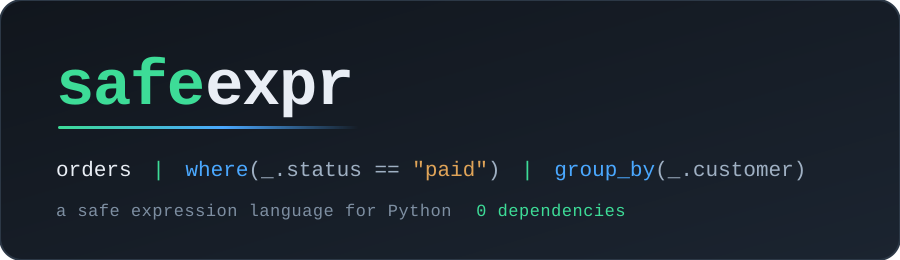

<p align="center">
  
</p>

<p align="center">
  <b>CEL-class expression evaluation for Python, at simpleeval's dependency cost.</b>
</p>

<p align="center">
  <a href="https://github.com/kmoneil/safeexpr/actions/workflows/ci.yml"></a>
  <a href="LICENSE"></a>
  <a href="#requirements"></a>
  <a href="#install"></a>
  <a href="#install"></a>
  <a href="THREAT-MODEL.md"></a>
</p>

```
user.plan == "pro" and user.region in ["us", "eu"]
metrics | where(_.value > threshold) | first
orders | where(_.status == "paid") | group_by(_.customer)
```

Rules your config authors can write, evaluated in your process, with **zero runtime
dependencies**: pure stdlib, one `py3-none-any` wheel, nothing compiled and nothing transitive.
The language is a strict subset of Python's own expression grammar, so there is no new syntax to
learn and no parser generator to ship.

### What you get

|  |  |
| --- | --- |
| **Zero dependencies, and it is the product** | One pure-Python wheel. Asserted three ways: the metadata is read by a test, a built wheel is imported in an interpreter with nothing else in it, and a CI lane runs the second |
| **Dot access, pipes, and forty-one functions** | `user.plan`, `orders \| where(...) \| group_by(...)`, collections, types, strings, regex, dates and URLs. All opt-in |
| **No lambda, and none needed** | `where(_.price > 10)` hands the function the comparison itself, unevaluated, and runs it once per item |
| **Every failure is one exception type** | `SafeExprError`, carrying the source and a position. Nothing else escapes, not even from CPython's parser |
| **A bound you can review** | One step counter per call. Not a timer, so no signal, no thread, and the same answer on every platform and in any thread |
| **A published threat model** | Nine classes of known sandbox escape, each with its advisories and the corpus entry proving it is unreachable here |

**Jump to:** [Install](#install) &nbsp;·&nbsp; [Quick start](#quick-start) &nbsp;·&nbsp;
[Documentation](#documentation) &nbsp;·&nbsp; [Reserved names](#reserved-names) &nbsp;·&nbsp;
[Limits](#limits) &nbsp;·&nbsp; [Thread safety](#thread-safety) &nbsp;·&nbsp;
[Non-goals](#non-goals) &nbsp;·&nbsp; [Alternatives](#alternatives) &nbsp;·&nbsp;
[Threat model](#threat-model)

## Install

Not published yet. The first release will be:

```console
pip install safeexpr
```

One pure-Python wheel, `py3-none-any`, no compiled artifacts, and nothing else pulled in. That
last part is the product rather than a detail, so it is asserted three ways rather than promised:
`tests/test_zero_deps.py` reads the built metadata, `scripts/check_zero_deps.py` imports a built
wheel in an interpreter that has nothing else in it, and the `zero-deps` CI lane runs the second.

Until then, from the source:

```console
pip install git+https://github.com/kmoneil/safeexpr
```

## Quick start

```python
from safeexpr import evaluate

evaluate(
    'user.plan == "pro" and user.region in ["us", "eu"]', {"user": {"plan": "pro", "region": "eu"}}
)
# True
```

Dots read dictionary keys, so `user.plan` and `user["plan"]` are the same lookup and a config
author writes the first without being taught. Nothing else about the value is reachable.

Functions and pipes are one argument away:

```python
from safeexpr import Evaluator, standard_registry

rules = Evaluator(registry=standard_registry())
rules.evaluate(
    'orders | where(_.status == "paid") | group_by(_.customer)'
    ' | map(merge(_, {"n": len(_.items)}))',
    {"orders": [{"customer": "c1", "status": "paid", "items": [1, 2]}]},
)
# [{'key': 'c1', 'items': [{'customer': 'c1', 'status': 'paid', 'items': [1, 2]}], 'n': 1}]
```

`Evaluator()` starts with no functions, and adding them is one argument rather than a default,
because a registered name is reserved on the right of a `|`: with `first` registered,
`flags | first` calls it whatever the context says `first` is. See
[Reserved names](#reserved-names).

Build the evaluator once, at import time, and evaluate per record. It is immutable and safe to
share between threads.

## Documentation

| Guide | What is in it |
| --- | --- |
| [Getting started](docs/getting-started.md) | Install, a first expression, the context, and pipes in thirty seconds |
| [The language](docs/language.md) | Every piece of syntax, and what is deliberately absent |
| [Function reference](docs/functions.md) | All forty-one functions plus `bitor`, each with a worked example and its refusals |
| [Pipes and `_`](docs/pipes.md) | What `\|` rewrites to, the item variable, nesting, and the one name collision |
| [Recipes](docs/recipes.md) | Feature flags, alert rules, access control, validation, routing, pricing, rollups, URL allowlists, config files |
| [Embedding safeexpr](docs/embedding.md) | Validating rules at load time, adding your own functions, attribute access, threads, untrusted input |
| [Errors](docs/errors.md) | The seven error classes, who has to fix each, and how to show one to a rule author |
| [Performance and limits](docs/performance.md) | The step budget, what a rule costs, and choosing one |

**And [`examples/`](examples/README.md) is documentation that executes.** Eighteen programs, each
running with no arguments and printing its own narrated output, every one of them run by the test
suite:

```console
python examples/quickstart.py          # one import, one call, and what it refuses
python examples/pipelines.py           # `|`, `_`, and the nine functions that take an expression
python examples/feature_flags.py       # a predicate per flag, changed without a deploy
python examples/what_is_refused.py     # thirty-four escape attempts, run rather than described
```

## Status

**Alpha.** The evaluator, the collections tier and pipes all work; the `CHANGELOG.md` "Known
limitations" section is kept current with exactly what does and does not exist. The
`Development Status :: 3 - Alpha` classifier stays until the escape corpus ships and passes on
every supported interpreter, because that corpus is the security claim.

Forty-one functions across six tiers: collections, types, strings, regex, dates and URL. Three
things worth knowing before you reach for them: `str` converts primitives and refuses arbitrary
objects, because converting one would run that object's own code to produce the text; `slugify`
is ASCII in core, so a script with no ASCII form is dropped rather than transliterated; and
`matches` refuses patterns that can backtrack catastrophically.

That last one is a real restriction, so it is worth stating plainly. `^(a+)+$` against a
29-character input takes seven seconds, so no input-length cap helps and the pattern itself is
refused before it compiles. A pattern is refused if it nests one backtrackable repeat inside
another, or repeats an alternation whose branches match the same text. **Atomic groups and
possessive quantifiers reset that**, so `^(?>a+)+$` and `^(a++)+$` are accepted where `^(a+)+$`
is not; both are available on every supported version, which is 3.11 and later. The gate is
deliberately conservative and refuses a few patterns that happen to be fast.

### Reserved names

Registry membership is what tells the pipe transform that a `|` is a pipe rather than bitwise-or,
and that decision never looks at your data, so an expression means the same thing whatever it is
evaluated against. The price is that **a function name on the right of a `|` always wins**: with
`first` registered, `flags | first` calls the function even if your context has a `first`.

That collision is refused with a `ReservedNameError` naming the key, rather than quietly reading
past it. Only the right of a `|` is affected. A bare `min` reads your data as it always did, so
`metrics | where(_.value > min)` against `{"min": 10}` is correct and is not refused, and
`first(x)` is unambiguous because a value from the context can never be called. `bitor(a, b)` is
the way to say bitwise-or on a value that shares a function's name.

The reserved names are exactly the registry's, so `Evaluator.function_names` is the list, and

```python
sorted(set(my_context) & rules.function_names)  # empty means no collisions
```

is the check to run at startup if you would rather know early. With `standard_registry()` they
are:

```
all_ any_ bitor bool contains default ends_with extend first float format_date group_by int
is_none join last len lower map matches max max_by merge min min_by parse_iso pluck replace
slugify sort_by split starts_with str strip sum take unique_by upper url_host url_path url_query
where
```

[Pipes and `_`](docs/pipes.md) has the longer version, including the three ways out of a
collision, and `python examples/reserved_names.py` runs all of them.

## Limits

Every evaluation runs under a **step budget**: one counter, decremented per node evaluated,
shared across nested evaluation, raising `BudgetExceededError` rather than running on. It is a
counter and not a timer, so it needs no `signal`, no thread and no executor, gives the same
answer on every platform and inside any thread, and bounds a filter over a context of any size.
Set it with `Evaluator(budget=...)`; the default is six million steps.

The budget also bounds **memory**, because producing a value costs steps in proportion to its
size. That closes the gap where `rows | map(t + t)` allocated hundreds of megabytes from a
seventeen-character expression while costing almost nothing to evaluate. Anything under 64
elements is charged nothing, so ordinary rules are unaffected, and lowering the budget tightens
the time bound and the memory bound together.

Every limit is set from a measurement at **ten times observed need or more**, and
`python scripts/limits.py` reproduces the table on your own machine. `tests/test_limits.py`
re-checks the ratios, so a number that drifts out of its own rule fails the suite rather than
sitting in a comment.

| Limit | Value | Measured need | Ratio |
| --- | --- | --- | --- |
| Source length | 2,048 bytes | set by 3.11's parser, not by need | |
| Expression nesting | 125 | 12, a tangled but real rule | 10.4x |
| Data nesting | 1,000 | 7, a nested configuration tree | 143x |
| Result size | 1,048,576 elements | 100,000, a map over 10⁵ items | 10.5x |
| Step budget | 6,000,000 | 538,433, the heaviest use case at 10⁵ items | 11.1x |
| Power result | 1 MiB of integer | set by measured time; no rule needs large powers | |

### What happens past one

Every limit refuses rather than degrades, and each refusal is a `SafeExprError` that names what
was exceeded and by how much. Nothing is truncated, nothing is silently approximated, and no
limit is a warning.

| Past this | You get |
| --- | --- |
| Source length | `SourceTooLongError`, before `ast.parse` ever sees the source |
| Expression nesting | `ValidationError`, naming the depth and the cap |
| Step budget | `BudgetExceededError` |
| Result size, power result, data nesting | `EvaluationError` |

**The supported scale is ten times a hundred thousand items**, on the heaviest of the five
canonical use cases, and that is the design's own rule of ten times observed need applied to a
measurement rather than to a guess. Past it you get `BudgetExceededError` rather than a slow
answer, which is the whole point of a counter: the failure is deterministic, it is the same on
every platform and in every thread, and it arrives before the work does rather than after.

If a hundred thousand items is not your scale, say how much more you need. There is deliberately
no value meaning "unlimited": a bound you cannot express is a bound you cannot review.

**Reference timing.** The five canonical use cases at 100,000 items: the heaviest is the pipeline
at 538,433 steps in 153 ms, and the rate is **4.0 to 5.4 steps per item**, stable across 10³, 10⁴
and 10⁵. That rate is what makes a budget expressible in items rather than in nodes: at the
originally proposed 100,000 steps it would have covered about twenty thousand items and raised on
a hundred thousand. [Performance and limits](docs/performance.md) has the table for choosing a
budget, and `python examples/budget.py` measures what your own rule costs.

### Changing them

Three are constructor arguments on `Evaluator`, and those three are the whole configuration
surface:

| Argument | Default | What it decides |
| --- | --- | --- |
| `registry` | empty | The only names an expression may call. `standard_registry()` is the forty-one shipped functions |
| `attribute_types` | empty | Opt-in `getattr`, as type to permitted attribute names |
| `budget` | 6,000,000 | Steps one `evaluate` call may spend. Per call, not per evaluator |

```python
rules = Evaluator(registry=standard_registry(), budget=60_000_000)
```

**`attribute_types` is the one argument that gives something up**, and it is worth saying plainly:
registering a type opts that type back into attribute traversal, which is where essentially every
published Python sandbox escape has started. It is limited to the attribute names you list, and
what you list is yours to defend. Everything else in this package is closed by default; this is
the door, and it only opens from your side. `python examples/attributes.py` shows a property
running your code three times from inside an expression, which is what that sentence means.

Every other limit is a module constant rather than configuration. Source length is set by CPython
3.11's parser rather than by preference, and the rest are set from measurement at ten times
observed need. They are readable (`safeexpr._validate.MAX_EXPRESSION_DEPTH` and friends) and
changing one means changing the package, which is the intended difficulty: they bound what an
expression can do to your process, and a knob for that is a knob an over-eager caller turns.

## Thread safety

**One `Evaluator` is safe to share between threads, and that is a contract rather than an
observation.** It is fixed after construction and **no evaluation can observe state left by
another**: the registry and the permitted attribute types are copied at construction rather than
held, so a host that keeps the dict it passed in cannot change what an evaluator can do
afterwards, and `__slots__` means nothing can be attached later.

Everything one evaluation needs lives in a call-scoped object: **the step counter and the `_`
scope stack included**. The budget is therefore per call and not per evaluator, so two threads
never spend each other's, and a thread that exhausts its budget refuses its own evaluation and
nothing else. A counter on the instance would have made a shared evaluator quietly wrong under
concurrency, with an error naming the budget rather than the sharing.

Nothing here starts a thread, installs a signal handler or sets a timeout, so there is no
interaction with whatever your host already does about any of those. That is a consequence of the
budget being a counter rather than a clock.

**Two things are cached, and both are memoisation caches**, which is the one kind of shared state
that does not make this dishonest. An evaluator remembers the compiled form of each source it has
seen, and a bounded cache of compiled regular-expression patterns is shared process-wide.

Compiling is a pure function of the source and the registry, and the registry is fixed at
construction, so a hit and a miss produce the same tree. The step budget is charged the same number
of steps either way, and the language has no clock, so **nothing inside an expression can tell a
warm cache from a cold one**. That is proved rather than argued: `tests/test_thread_safety.py` and
`tests/test_compile_cache.py` bisect the smallest budget that evaluates, on a cold cache and again
on a warm one, and compare the two numbers. `python examples/threads.py` runs the lot.

The compiled-expression cache holds 128 entries per evaluator and is dropped whole when it fills.
It is bounded rather than a plain dict because a host that accepts expression text from an
untrusted source would otherwise hold an unbounded allocation keyed by that text; the bound and
what it can cost are in [Performance](docs/performance.md#limits) beside every other limit.

## Non-goals

These are not "not yet". They are the shape of the package, and each one is load-bearing.

- **Not Turing-complete.** No loops, no recursion, no user-defined functions, no assignment, no
  walrus, no comprehensions, no lambdas. The absence of iteration constructs is the termination
  guarantee, and the step budget is only a backstop behind it. Several of these read as
  ergonomic and are not: comprehensions and generators expose `gi_frame`, which is a published
  escape in another sandbox, so "no comprehensions" is a security decision. See F6 in
  `THREAT-MODEL.md`.
- **No I/O of any kind, ever.** No files, no sockets, no subprocesses, no imports. This is not a
  query language for an external store, and there is no plan for it to become one. The
  audit-hook tripwire under `How this is tested` exists to keep this true by observation rather
  than by intention.
- **No clock, and no randomness.** An expression is a pure function of its context, so the same
  rule against the same data gives the same answer forever, in a test, in a replay and in
  production. A rule about "recent" takes the time from the host, as a value.
- **Not CEL, and not CEL-compatible.** The semantics are close enough to be useful and are not a
  promise. Anyone who needs CEL semantics should pay CEL's dependency cost rather than ask this
  package to grow into them.
- **No string interpolation.** f-strings, and t-strings on 3.14, are rejected by the node
  allowlist. This is F1 rather than taste, and it is worth spelling out because the syntax looks
  inert: `f"{obj}"` calls that object's own `__format__`, `f"{obj!r}"` its `__repr__`, `f"{obj!s}"`
  its `__str__`, and `f"{obj:{spec}}"` hands its `__format__` a spec computed at runtime. That is
  four ways to run a context object's own code, on values the `str` function already refuses to
  convert for exactly that reason, wearing a syntax a static check reads as one node. Use `+` or
  `join` to build strings. If interpolation is ever allowed, the corpus entries proving the
  conversions are unreachable land in the same change, not after it.
- **No custom grammar, ever.** The syntax is a strict subset of Python's own expression grammar,
  parsed by stdlib `ast`. One extension Python's parser cannot express means shipping a parser
  generator, and that is the end of the package: the pitch is one pure-Python wheel, and a
  grammar of our own is how that stops being true.

## Alternatives

The honest version, with the figures checked against PyPI metadata on 2026-08-23. Re-check them
before quoting them anywhere; a dependency count is a fact with a date on it.

| Package | Version checked | Runtime deps | What you give up |
| --- | --- | --- | --- |
| **safeexpr** | unreleased | **0** | The gap between the two rows below it |
| `simpleeval` | 1.0.7 | 0 | No dot access on dicts, no data functions, no pipes. Deliberately bare |
| `asteval` | 1.0.10 | 0 | Denylist-leaning, with the escape history that implies |
| `RestrictedPython` | 8.5 | 0 | Transforms whole modules rather than evaluating expressions. ZPL-2.1 |
| `jmespath` | 1.1.0 | 0 | Query only: no arithmetic to speak of, no conditionals, no joins |
| `cel-python` | 0.5.0 | 6 | Nothing, on capability. Six runtime dependencies is the price |

`cel-python`'s six are `google-re2`, `jmespath`, `lark`, `pendulum`, `pyyaml` and `tomli` (below
3.11). That means a parser generator and a compiled regular-expression engine, so platform wheels
and a longer procurement conversation. CEL also mandates re2 regex syntax.

Two notes on that table that matter more than the counts:

- **`asteval` no longer requires numpy.** Version 1.0.10 has zero runtime dependencies and numpy
  is optional. Older comparisons say otherwise, this one included in an earlier draft, and
  repeating it would be unfair.
- **`RestrictedPython` is ZPL-2.1, not MIT.** It can be studied and it cannot be copied from,
  which is why nothing here is derived from it.

Every claim about another project's escape history lives in `THREAT-MODEL.md` with its advisory
identifier, rather than as an adjective here.

**Go is not in this table on purpose.** `expr-lang/expr` is mature, fast and effectively
dependency-free, so the Go slot is filled. This package is Python only.

## How this is tested

Beyond the escape corpus, four things run on every supported interpreter:

- **Differential testing against CPython.** Generated expressions inside the safe subset must
  give the answer `eval` gives, or both must refuse. Coverage of the node allowlist is asserted,
  so a generator that drifts toward easy cases fails rather than passing quietly.
- **An audit-hook tripwire.** `python scripts/audit_fuzz.py` fuzzes the evaluator with
  `sys.addaudithook` watching, and fails if **any** audit event fires during evaluation beyond
  this package parsing its own source. `exec`, `import`, `open`, `os.system` and the subprocess
  events are all observed process-wide, so an escape trips it whether or not anybody wrote a test
  for that escape.
- **A published limits measurement.** `python scripts/limits.py` reproduces the table above.
- **The documentation, executed.** Every expression example in `docs/` is evaluated and compared
  to its printed result, every code block is run and compared to the output it claims, and every
  program in `examples/` is run as a subprocess with its central claim pinned. An example that has
  drifted out of step with the library fails a build rather than misleading a reader.

> **Audit hooks are a test tripwire here, not a defence layer, and nothing installs one at
> runtime.** They observe rather than block; they fire process-wide, so a host would pay for
> every audited operation in its process; and a hook cannot be uninstalled once added, which
> makes it a target rather than a shield if a sandbox is already broken. If you want one in your
> own process, that is your decision to make on its own merits.

## Threat model

> Expressions come from semi-trusted config authors, not anonymous internet users. The sandbox is
> defense in depth for a config-authoring surface. If you must run genuinely hostile input, use
> process isolation. No in-interpreter CPython sandbox, this one included, should be your only
> boundary.

`THREAT-MODEL.md` is the catalog behind that statement: nine classes of published sandbox escape,
one section each, with the mechanism, the advisories where it has broken a real project, and the
corpus entries proving it is unreachable here. Every entry id in it is also a pytest node id, so
any single claim runs with `pytest tests/test_corpus.py -k <id>`. To watch the refusals happen
instead, `python examples/what_is_refused.py` runs thirty-four attempts and prints what each one
gets back.

One disclosure is deliberate and worth knowing about: **an error names the type of a value it
could not work with**, so "cannot compare `Order` with `int`" tells an expression author a class
name from your context. Never a value and never a `repr`, and a name is a string rather than a
class object, so there is nothing to climb. It is the only thing about your data an error here
gives up, and `THREAT-MODEL.md` records why the trade was taken.

**A sandbox escape is always a critical bug here.** Not a hardening opportunity and not "working
as designed for semi-trusted input". Every accepted escape ships as a new release rather than a
silent push, with a CVE requested, the reporter credited, and a corpus entry added in the same
change, so a hole that is fixed once stays fixed. Report one privately and never in a public
issue: `SECURITY.md` has the contact and the process.

## Requirements

Python 3.11 through 3.14. No runtime dependencies, and that is asserted by
`tests/test_zero_deps.py` and by the `zero-deps` lane, which imports a built wheel in an
interpreter that has nothing else installed.

## Prior art

`simpleeval` (MIT, Daniel Fairhead) is the closest thing in this space and was studied closely
while designing this package. Its regression tests for CVE-2026-32640 are a source for our escape
corpus. It is **not** vendored and this package does not depend on it.

## Licence

Apache-2.0. See `LICENSE`.
